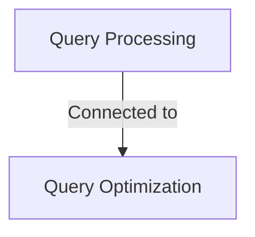

# Tutorial: wiremock

Project with 2 components

**Source Repository:** [None](None)

## Chapters

1. [Query Optimization](01_query_optimization.md)
2. [Query Processing](02_query_processing.md)

---

Generated by [AI Codebase Knowledge Builder](https://github.com/The-Pocket/Tutorial-Codebase-Knowledge)